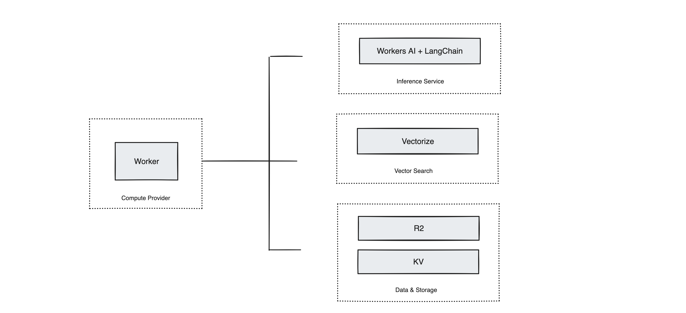

# Architecture

### Components

- **Compute**: 
  - **CF Worker**: Core functionalities (Train/Ask/Report) consumed visa REST API or RPC.

- **Inference**: 
  - **LangChain**: Framework for RAG implementation.
  - **Workers AI**: Provides AI capabilities.

- **Vector Search**: 
  - **Vectorize**: Vector database for embeddings and similarity matching.

- **Data/Storage**: 
  - **R2**: Stores training files.
  - **KV**: Key-value store for documents like URLs.
